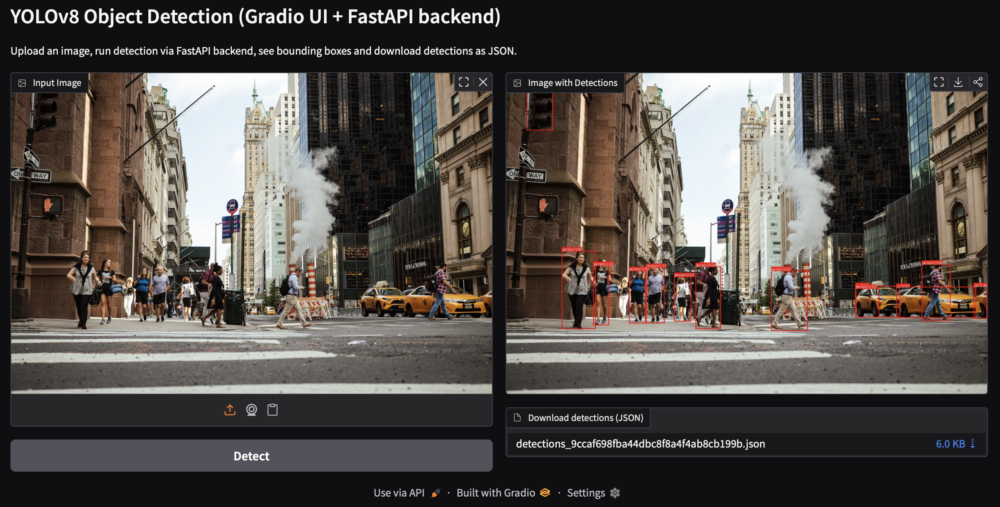

# YOLOv8 Object Detection API

**FastAPI + Docker backend with a Gradio UI for real-time object detection using pretrained YOLOv8.**



## Overview

This project demonstrates a real-world, production-style ML deployment using:

- **YOLOv8 (Ultralytics)** for object detection (pretrained COCO model — no training needed)
- **FastAPI backend** wrapped inside a Docker container
- **Gradio UI frontend** running locally to interact with the backend
- A clean **OOP architecture** centered around a `YoloObjectDetector` class

The goal of this repository is to show how a computer vision model can be packaged, served, and used in an interactive UI—exactly how modern ML services work in industry.

## Features

- **YOLOv8 pretrained model (no training required)**  
  Loads the official Ultralytics model and performs inference out-of-the-box.

- **FastAPI backend (Dockerized)**  
  A clean REST API with:
  - `GET /health`
  - `POST /predict` → returns bounding boxes, labels & confidence scores as JSON

- **Gradio UI frontend**  
  Upload any image and:
  - View object detection results visually
  - Download detection results as a `.json` file

- **Object-Oriented Model Wrapper**  
  Central `YoloObjectDetector` class handles:
  - Model loading
  - Preprocessing
  - Inference
  - JSON formatting

- **Production-style architecture**  
  Frontend and backend communicate via HTTP, just like real ML systems.

## Project Structure

```bash
yolov8-object-detection-api/
├── app/
│   └── main.py             # FastAPI backend (Dockerized)
├── assets/
│   └── app_ui.png
├── ui/
│   └── app.py              # Gradio UI frontend
├── detector.py             # OOP wrapper for YOLOv8 inference
├── requirements.txt        # Python dependencies
├── Dockerfile              # Build the backend container
└── README.md
```

## Backend Setup — FastAPI in Docker

This runs the YOLOv8 inference server.

**Build the Docker image:**

```bash
docker build -t yolov8-api .
```

**Run the container:**

```bash
docker run -p 8000:8000 yolov8-api
```

**Test the API:**

- Health check:

```bash
curl http://localhost:8000/health
```

- Swagger docs:

Visit <http://localhost:8000/docs> in your browser.

## Frontend Setup — Gradio UI

The UI runs locally on your machine. It sends requests to the FastAPI container.

**Install dependencies locally:**

```bash
pip install -r requirements.txt
```

**Run the Gradio UI:**

```bash
python ui/app.py
```

Gradio will launch at: <http://localhost:7860>.

## How It Works

1. User uploads an image via Gradio.
2. Gradio sends the image to `POST /predict` on the FastAPI backend.
3. FastAPI loads YOLOv8 and runs inference.
4. Backend returns JSON:

```json
{
  "num_detections": 3,
  "detections": [
	{"class_name": "person", "confidence": 0.92, ...}
  ]
}
```

5. The UI overlays bounding boxes and generates a downloadable `.json` file.

## API Endpoints

- `GET /health` — Check server status  
  Response: `{ "status": "ok" }`

- `POST /predict` — Send an image and receive JSON detections.

Swagger documentation is available at: <http://localhost:8000/docs>

## Technologies Used

| Component        | Technology            |
|------------------|-----------------------|
| Model            | YOLOv8 (Ultralytics)  |
| Backend          | FastAPI + Uvicorn     |
| Frontend         | Gradio               |
| Containerization | Docker                |
| Language         | Python 3.11           |

## License Notes

This project uses: **YOLOv8** from Ultralytics (AGPL-3.0 license)

## Future Enhancements

- Add `docker-compose` to containerize both backend and UI
- GPU-enabled Dockerfile
- Add a custom trained YOLOv8 model
- Deployment on AWS/GCP/Azure